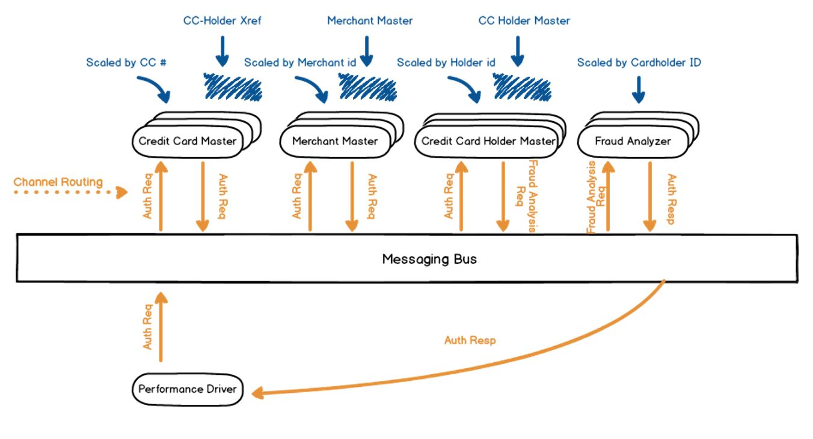

# Introduction
This project is based on card processing solution donated by Kode41 which showcases a fraud detection usecase using the X Platform. 

See also:
* White Paper (coming soon)
* [Presentation Deck](docs/nvx-fraud-detection-presentation.pptx?raw=true) (PDF)

# Fraud Detection System Built on Microservices Architecture with X Platform (TM)
A fraud detection component of the card payment processing system is illustrated below.

The above implements a processing system for card association network. But this solution can be adapted to use by the issuing bank to involve full payment processing as well.
 
The above architecture comprises four main micro applications. 

* *MerchantMaster* holds data on merchants, such as stores' locations, terminals etc. It is used to enrich authorization requests with addition merchant information. It shards and scales based on merchant id. 
* *CardMaster* is registry for card numbers. It is sharded by card number. It identifies the card holder by card number so that the authorization request can be routed to the CardHolderMaster instance that contains that card holders transaction history.  
* *CardHolderMaster* keeps transaction history of the card holder. State is sharded by cardholder id. First fraud analysis is performed there, and is based on user’s history. For example, merchant location and timestamp can be checked against previous transaction. It is not possible to purchase in two stores hundreds of miles apart, in a span of few minutes. 
* *FraudAnalyzer* performs general analysis. It is based on statistical/trained model of machine learning component, possibly accelerated by hardware. Training is performed by using potentially all data. It is replicated for scalability. Messaging layer works on X Platform’s Solace broker. Serialization on the bus is XBuf – an efficient binary serialization protocol.
* *Perf Driver* The performance driver that sends on simulated authorization requests. 

Illustration 3 shows message flow during authorization request. Authorization Request, containing transaction data, entered at merchant’s site, arrives into CardMaster instance. CardHolder instance will identify CardHolder by card number. 
CardMaster then appends this information to the authorization request, and forwards it to CardHolderMaster instance. CardHolderMaster instance holds history of past purchases, so it will perform first initial checks. Both statistical checks and explicit checks against past transactions run in CardHolderMaster instance.
CardHolderMaster may send message to MerchantMaster to find some information on merchant and the location of purchase, which will aid in scoring. If score is below defined threshold, CardHolderMaster will forward authorization request transformed and appended with additional information to FraudAnalyzer instance. 
If score is above threshold, transaction is suspicious or a fraud, and response will return to caller. 
FraudAnalyzer is lightweight instance in terms of state. It holds mathematical model for further classification. Nodes where this app is deployed may have hardware accelerators such as OpenCL FPGA or graphic cards. X Platform ™ works well with Java Native Interface, so it integrates well with common libraries for vector calculations and machine learning, such as Google’s TensorFlow.

