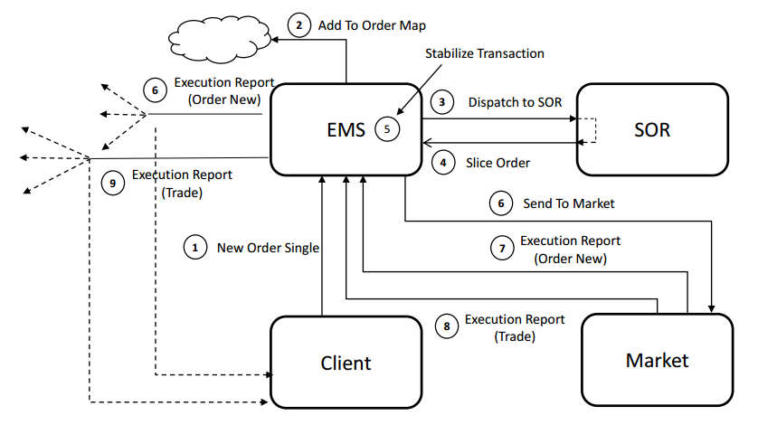

# Hornet Tick to Trade Application

**See how a 100% Pure Jave application with no infrastructure bleed can be built on top of Hornet and The [X Platform](http://www.neeveresearch.com/introduction) to serve up trades in the 10s of microseconds.**

Want to get started? See the **[Getting Started Page](https://github.com/neeveresearch/nvx-apps/wiki/Getting Started with Tick To Trade)**

The Tick To Trade app is intended to highlight the speed, simplicity, flexibility and reliability of X Platform applications ... the EMS and SOR implementations here are deliberately simple so as not to obscure the mechanics of Hornet and the X Platform with the business logic. 

###  SPEED
**Tick to Trade**: “How fast can your EMS respond to advertised price?”

### SIMPLICITY
“How agile are you at being able to change your business logic?”

### FLEXIBILITY
"How easy is it to deploy X Platform Applications in different topologies and infrastructure components?"

---

### OVERVIEW
The following diagram outlines the overall flow for this application. In a nutshell there is a client that sends a NewOrderSingle to an Execution Management System that delegates to a SOR to slice the order to an exchange that fills the order. 


[Ems.java](src/main/java/com/neeve/tick2trade/Ems.java)
```java
    /**
     * Handler for {@link EMSNewOrderSingle} messages sent by the client.
     * <p>
     * NewOrderSingles are dispatched to the SOR which will route the order to a
     * liquidity venue. In this simple sample we only have one
     * 
     * @param message
     *            The new order from a client.
     */
    @EventHandler
    final public void onNewOrderSingle(final EMSNewOrderSingle message) {
        // update statistics:
        rcvdOrderCount++;
        rcvdMessageCount++;
        
        // read fields from EMSNewOrderSingle (pojo) into an Order object
        final Order order = EMSNewOrderSingleExtractor.extract(message, orderPool.get(null));
        order.setNosPostWireTs(message.getPostWireTs());
        orders.put(order.getClOrdId(), order);
        
        // dispatch a SORNewOrderSingle to the SOR for market routing.
        app.send(SORNewOrderSinglePopulator.populate(SORNewOrderSingle.create(), order));
        
        // issue an EMSOrderNew which serves as an acknowledgement to the
        // issuing client.
        app.send(EMSOrderNewPopulator.populate(EMSOrderNew.create(), order));
    }
```

### PROJECT LAYOUT
src/main/java/com/neeve/tick2trade
* **App.java**: Binds together applications components (insert your favorite DI framework here)
* **Ems.java**: A simple EMS implementation that tracks order state and sends messages. 
* **Sor.java**: A dumb Sor implementation that simply routes an order to a single venue.
* **driver**  : Contains the Client and Market drivers equivalent to order and exchange gateways.
* **domain**  : Plain Old Java Object domain state. 
* **acl**     : Anti Corruption Layer populates and extracts message fields from/to state. 

src/main/resources/com/neeve/tick2trade/messages
* **messages.xml**: Models the messages used to generate classes (see [ADM Modeling](https://docs.neeveresearch.com/display/KB/ADM+Message+Modeling))

conf/services
* Maps message types to message channels (topics)

conf/xplatform.xml
* Single XML document describing the application deployment topology and configuration See [Configuration](https://docs.neeveresearch.com/display/KB/X+Platform+Configuration)

conf/profiles
* Augments the platform configuration for various deployment topologies. 

bin
* contains scripts used to launch applications. 

### Background Reference:
* [Introduction to the X Platform](http://www.neeveresearch.com/introduction)
* [Take a look at the presentation](http://docs.neeveresearch.com/decks/nvx-low-latency-apps.pdf)

---

To build and run this application on your own you will need an __Evaluation__ license to download and run the X platform from our repositories. See the **[Getting Started Page](https://github.com/neeveresearch/nvx-app-hornet-tick-to-trade/wiki/Getting-Started)** for instructions.
